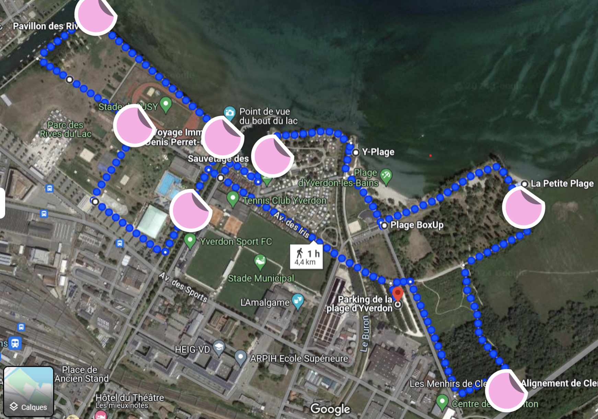
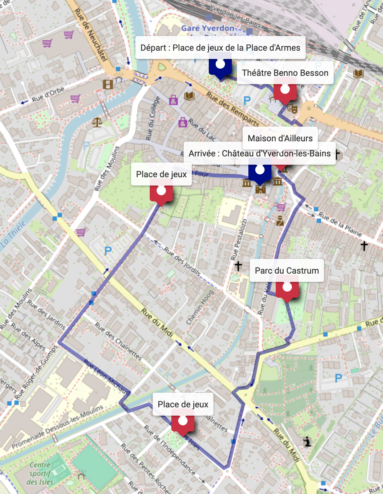

footer: Team AppY - ProjInt - 2024
slidenumbers: true

# appY
### Sprint 2

---

# Storytelling

---

# Parcours dans Appy

---

^ Parcours en nature
^ Thème de l'eau
^ ~ 60 minutes de marche
^ Chemin : Place de jeux de la Place d'Armes -> Théâtre Benno Besson -> Maison d'Ailleurs -> Parc du Castrum -> Place de jeux - Rue des Isles -> Place de jeux - Rue Roger-de-Guimps -> Château d'Yverdon-les-Bains

---

^ Parcours en ville
^ Thème des créatures mystérieuses
^ ~ 45 minutes de marche
^ Chemin : Parking de la plage d'Yverdon -> Les Menhirs de Clendy -> La Petite Plage -> Sauvetage des Iris -> Voyage Immobile Denis Perret-Gentil -> Pavillon des Rives -> Stade de l'USY -> Tennis Club Yverdon

---
## UI/UX

- Études préliminaires
- Personas
- Fonctionnalités
- Prototype papier
- Maquettage Figma
- 
^ Empathy map, Modèle de représentation, Personas, Matrice must have

---

## UI/UX

---

## Livrables

- Quels sont les attentes ?
- Qui va maintenir l'application ?
- Contraintes techniques de l'état ?

^ On peut pas fournir une application fonctionnelle en 5 semaines..
^ Mieux vaut fournir un rapport concernant toutes les réflexion UI/UX que la ville pourra transmettre à une agence de dev si elle débloque les fonds

